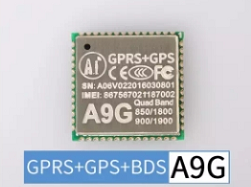

[Ai-Thinker GPRS C SDK](https://github.com/Ai-Thinker-Open/GPRS-C-SDK)
=====

Ai-Thinker GPRS development SDK written by C
安信可GPRS模组二次开发SDK C语言版

[English Version](./README_EN.md)


## (一) 硬件

* **A9 GPRS 模块**


特征：
  * 32位内核，主频3高达312MHz，4k指令缓存，4k数据缓存
  * 多达29个GPIO（两个GPIO作为下载口）
  * 实时时钟、闹钟
  * 1个USB1.1接口
  * 2个带流控的UART接口（+1个下载调试串口）
  * 2个SPI接口
  * 3个I^2^C接口
  * 1个SDMMC控制器（接口）
  * 2个10位ADC接口
  * 32Mb(4MB) SPI NOR Flash
  * 32Mb(4MB) DDR PSRAM
  * 8kHz、13Bits/sample ADC mic
  * 48kHz、16bits/sample DAC Audio
  * 电源管理单元：锂电池充电管理、集成DC-DC及LDOs、可变化的IO电压
  * 18.8 x 19.2 mm SMD封装
  * 四频GSM/GPRS（800/900/1800/1900MHz)
  * 语音通话
  * 短信服务

* **A9G GPRS+GPS+BDS模块**



特征：
  * A9所有特征
  * 集成GPS+BDS(和串口2连接)

* **A9/A9G GPRS(+GPS+BD) 开发板**


A9/A9G开发板，方便开发和调试
特征：
  * 1个A9G模块（A9和A9G采用相同封装，引脚相同,所以开发板通用）
  * 引出模块29个GPIO（包括2个下载调试引脚（`HST_TX`,`HST_RX`）
  * 1个SIM卡（Micro卡）卡槽(Mano卡<Micro卡<标准卡)
  * 1个TF卡卡槽
  * 1个GPRS IPEX1代座子
  * 1个GPS  IPEX1代座子
  * 一个USB接口
  * 5v-4.2V DC-DC，故可以5v供电或者3.8~4.2V供电
  * 1个加速度计LIS3DHx芯片
  * 1个开机按键，1个复位按键
  * 2个连接到GPIO的LED灯
  * 1个麦克风


> 注意图中的所有引脚名均为A9/A9G内主芯片的引脚，A9G内部串口2已经和GPS连接，即开启GPS后`RX`脚会输出GPS输出的原始信息

* **USB转串口模块**


当然，为了下载和调试，需要一个USB转串口模块

* **锂电池**
用来给模块供电，或者使用5V电源也行，USB转串口模块直接供电也行，要保证有足够的电流供应


## (二) 开发环境搭建

参见[开发环境搭建文档](./doc/compile_environment_zh-cn.md)
如果已经搭建好了，使用`build.sh`脚本来编译工程，打开cygwin进入到工程目录，有以下参数：
* 使用 `./build.sh $PROJ`来编译你的应用模块，如 `./build.sh app` 则是编译app目录下的源码
* 使用 `./build.sh demo $PROJ` 来编译demo目录下的特定例程
* 使用 `./build.sh clean $PROJ` 清除`$PROJ`目录的中间文件
* 使用 `./build.sh clean all` 清除所有中间文件

## (三) 下载、调试

如何使用下载调试工具：参见[下载、调试文档](./doc/download_debug_tool_zh-cn.md)

**需要下载的文件**：编译后`hex`目录下有`*_B*.lod`以及`*_flash.lod`两个文件，第一次下载需要下载第一个文件（较大的文件），后面只需要下载`*_flash.lod`文件即可

## (四) SDK

#### SDK特征

* 提供简单的API，只要有C语言开发基础就可以快速使用
* 提供大量使用的API，从基本的GPIO、UART、SPI、IIC、OS、FS... ... 到特有的GPRS联网(socket、dns)、短信、电话等一应俱全


#### 获得SDK

* 方法一：在 [安信可官网Wiki]()下载压缩包

* 方法二：在代码托管在[github](https://github.com/Ai-Thinker-Open/GPRS-C-SDK)上
  * 可以在从github[下载压缩包](https://github.com/Ai-Thinker-Open/GPRS-C-SDK/archive/master.zip)
  * 或者克隆工程到本地
```
git clone https://github.com/Ai-Thinker-Open/GPRS-C-SDK.git --recursive
```

#### SDK目录结构：

|  目录  |  描述  |
|  ---   |  ---  |
|app     |  程序主目录，应用代码放在这里|
|build   |  编译生成的目录、中间文件    |
|demo    |  一些例程                   |
|doc     | 一些SDK相关的文档，Markdown格式，可在github在线阅读，也可用相关软件打开阅读，官网Wiki的压缩包会提供`html`格式的文档，可以直接用浏览器打开阅读
|hex     |  最后产生的可烧录文件        |
|include |  SDK文件目录                |
|init    |  系统初始化的目录，可以不用理会，不建议改动 |


## (五) 开发应用

当做好基本准备后，如果是大佬，拿上SDK直接上吧！

SDK的`demo`目录下有许多例程，有什么需要按照例程写就好了

如果是没有接触过GPRS的小白或者求稳！建议看一下这个文档！
[GPRS及SDK从零开始。。](./doc/gprs_start_from_scratch_zh-cn.md)


## (六) 提问及反馈

* 方式一：github[添加issue](https://github.com/Ai-Thinker-Open/GPRS-C-SDK/issues/new)

* 方式二：[安信可论坛讨论](http://bbs.ai-thinker.com/forum.php?mod=forumdisplay&fid=37)


## (七) 参与开发

克隆修改后提交PR


