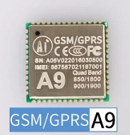
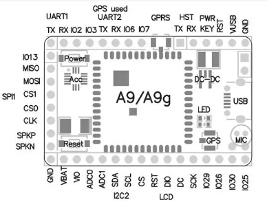
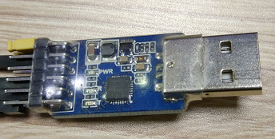

[Ai-Thinker GPRS C SDK] (https://github.com/Ai-Thinker-Open/GPRS-C-SDK)
=====

Ai-Thinker GPRS development SDK written by C.

Anxin GPRS module can be used to develop SDK C language version

[Chinese Version] (./README.md)


## (A) hardware

* **A9 GPRS Module** </br>
 </br>
Feature:
  * 32-bit core, clocked at up to 312MHz, 4k instruction cache, 4k data cache
  * Up to 29 GPIOs (two GPIOs as download ports)
  * Real-time clock, alarm clock
  * 1 USB1.1 interface
  * 2 UART interface with flow control (+1 download debug serial port)
  * 2 SPI interface
  * 3 I <sup> 2 </sup> C interfaces
  * 1 SDMMC controller (interface)
  * 2 10-bit ADC interface
  * 32Mb (4MB) SPI NOR Flash
  * 32Mb (4MB) DDR PSRAM
  * 8kHz, 13Bits / sample ADC mic
  * 48kHz, 16bits / sample DAC Audio
  * Power Management Unit: Lithium battery charge management, integrated DC-DC and LDOs, variable IO voltage
  * 18.8 x 19.2 mm SMD package
  * Quad-band GSM / GPRS (800/900/1800 / 1900MHz)
  * Voice calls
  * SMS service

* **A9G GPRS + GPS + BDS Module **</br>
 </br>
feature:
  * A9 all the features
  * Integrated GPS + BDS (and serial 2 connection)

* **A9 / A9G GPRS (+ GPS + BDS) Development Board** </br>
 </br>
A9 / A9G development board for easy development and debugging
feature:
  * 1 A9G module (A9 and A9G in the same package, the same pin, so the development board common)
  * Lead-out module 29 GPIOs (including 2 download debug pins (`HST_TX`,` HST_RX`)
  * One SIM card slot (Mano Card <Micro Card <Standard Card)
  * 1 TF card slot
  * 1 GPRS IPEX1 generation seat
  * 1 GPS IPEX1 generation seat
  * A USB interface
  * 5v-4.2V DC-DC, it can be 5v power supply or 3.8 ~ 4.2V power supply
  * 1 accelerometer LIS3DHx chip
  * 1 boot button, a reset button
  * 2 LED lights connected to GPIO
  * 1 microphone </br>
 </br>
> Note that all pin names in the figure are the pins of the main chip in the A9 / A9G. The internal serial port 2 of the A9G is connected to the GPS. That is, the "RX" pin after the GPS is turned on outputs the original information of the GPS output

* **USB to Serial Module** </br>
 </br>
It should be noted that the USB interface on the development board is not a USB serial port function, but USB1.1 function,
Therefore, in order to download and debug, you need a USB to serial port module adapter board `HST_TX` and` HST_RX` pin

* **Lithium Battery** </br>
Used to power the module, or use the 5V power supply is also OK, USB to serial module direct power supply is also OK, to ensure adequate current supply


## (B) development environment to build

See [Development Environment Build Documentation] (./doc/compilation_environment_en.md)

You can also refer to video tutorials: [Click to view video](https://www.bilibili.com/video/av16579395/)

If you have already set up, use `build.sh` script to compile the project, open cygwin into the project directory, the following parameters:
* Use `./build.sh $ PROJ` to compile your application modules such as` ./build.sh app` which is the source for compiling app directory
* Use `./build.sh demo $ PROJ` to compile specific routines in the demo directory
Use `./build.sh clean $ PROJ` to clear the middle of the` $ PROJ` directory
* Use `./build.sh clean all` to clear all intermediate files

If you encounter problems, please carefully compare the document or video to see if there is something wrong, can also be [issue](https://github.com/Ai-Thinker-Open/GPRS_C_SDK/issues?utf8=%E2%9C%93&q=) find there is no precedent

## (Three) Download, debug

How to use Download Debugging Tools: See [Download, Debug Documentation] (./doc/download_debug_tool_zh-cn.md)

** Need to download the file to the development board **: Compile the `hex` directory with` * _B * .lod` and `* _flash.lod` two files, the first download need to download the first file Big file), just need to download `* _flash.lod` file

If you run into problems, see the FAQs in the documentation, or you can find it in the [issue](https://github.com/Ai-Thinker-Open/GPRS_C_SDK/issues?utf8=%E2%9C%93&q=)No precedent

## (d) SDK

#### SDK Features

* Provide easy-to-use API, as long as the C language development foundation can quickly use
Integrates a wide range of features including basic GPIO, UART, SPI, IIC, ADC, OS, FS ... and GPRS, socket, dns, MQTT,


#### Get the SDK

Method 1: Download and distribute archives at the <a target="_blank" href="http://wiki.ai-thinker.com/gprs"> Wikipedia </a>

Method Two (recommended): When the code is hosted on [github] (https://github.com/Ai-Thinker-Open/GPRS-C-SDK)
  * You can download the newly released archive from github (https://github.com/Ai-Thinker-Open/GPRS_C_SDK/releases).
  > This release gets the released version of the code
  > Needs ** Note **: Download using the green <kbd> Clone or download </kbd> button in the top right corner of the page will result in tarballs without `SDK-LIB`, deprecated
  * Or use the following command to clone the project to local (need to install `git`, please pay attention to cloning need to add` --recursive` parameter, or get incomplete SDK file).
  > This method can be guaranteed to be the latest code
```
git clone https://github.com/Ai-Thinker-Open/GPRS_C_SDK.git --recursive
```

#### SDK directory structure:

| Contents | Description |
| --- | --- |
|app| home directory, application code here|
build | compiled directory, intermediate file |
demo | some routines |
| doc | Some SDK-related documentation, in `Markdown` format, available online at [github](https://github.com/Ai-Thinker-Open/GPRS_C_SDK/blob/master/README.md)|
| hex | last generated burnable file |
| include | SDK file directory |
| init | system initialization directory, you can ignore, do not recommend changes |


#### Develop applications using the SDK

Once you've got the basics ready, you can start the code

There are many routines in the `demo` directory of the SDK

If you have not been in contact with GPRS, or can not read the code, or have questions about the code, be sure to read through this document
[GPRS ​​and SDK start from scratch. . ](./doc/gprs_start_from_scratch_en.md)


## (five) feedback

* Way one: github [add issue](https://github.com/Ai-Thinker-Open/GPRS-C-SDK/issues/new)

* Way 2: [Shun peace forum discussion](http://bbs.ai-thinker.com/forum.php?mod=forumdisplay&fid=37)

* The upper right corner ★ <kbd> Star </kbd> one will not get lost Oh, the next convenient to find Oh ~


## (Six) Participate in the development

fork -> modify -> submit PR
